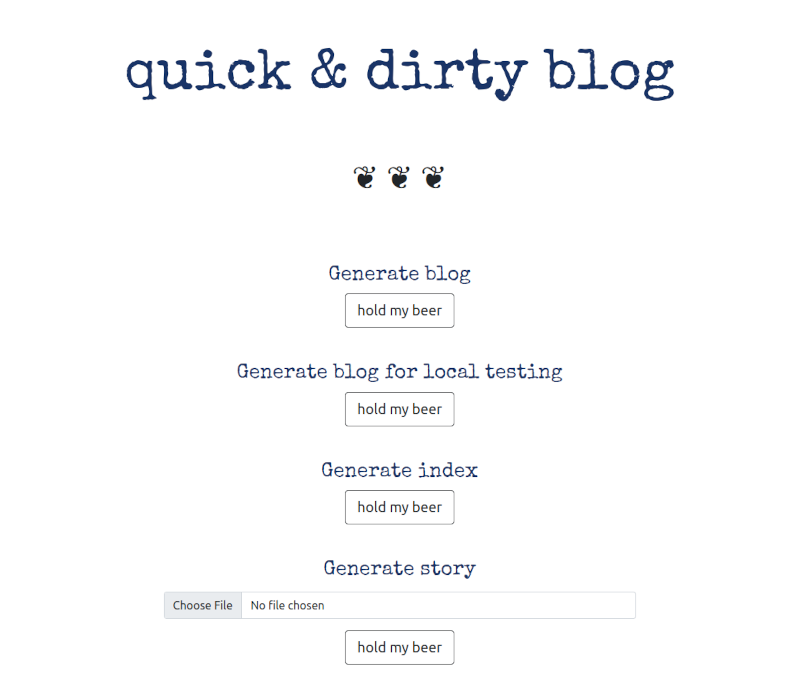

# clairempr.github.io

## quick & dirty blog generator

### Uses custom Markdown to generate html "story" pages

- `# `: Story Title
- `## `: Posted `date`  
- `### `: References header (will always be "References")
- `####`: Story title on main blog page`**`
- `> `: Blockquote  
- '```': Code block,
- Images use modified markdown to allow for setting width  
``  
- `### `: References header (will always be "References")  
- `- `: Reference list item  
- Anything else will be treated as a paragraph  

### To generate blog index page and story pages

#### Install requirements 

#### Change blog title if "quick & dirty blog" isn't good enough  
See setting `BLOG_TITLE` in `quick_and_dirty_blog.settings`

#### Create Markdown files for stories  
Create Markdown files with extension ".md" and put them in `INPUT_PAGES_DIR`  
Any images go in `INPUT_IMAGES_DIR`
Stylesheet is called `style.css` and goes in root `INPUT_DIR`   

#### Start up Django application  
```python manage.py runserver```  
  
#### Open blog generation page in browser 
```http://127.0.0.1:8000/blog/```  

#### Under **Generate blog**, click "hold my beer"  
  

### Output files will end up in the following places  
- `OUTPUT_DIR`: `index.html` and `style.css` 
- `OUTPUT_PAGES_DIR`: story pages   
- `OUTPUT_IMAGES_DIR`: images   
